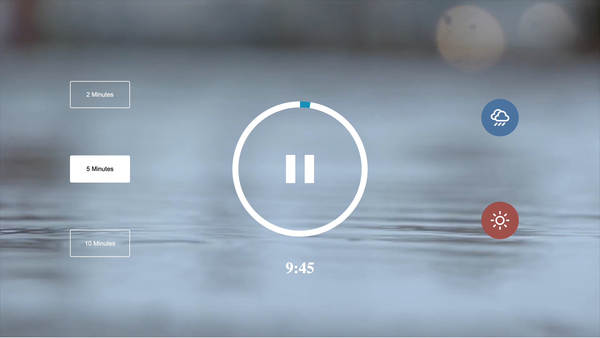

# Mock-SleepSounds-App

This is a mini mock sleep sounds app in Javascript that allows you to listen to the sounds of the beach or rain. User can click on either the sun or rain icon to choose their perfered sound and also chose 1 of 3 duration intervals: 1 minute, 5 minute, 10 minute.

The purpose of this app was to learn how to utilize <code>querySelector()</code> method, manipulate SVG's and call/loop sound files.

    

    

